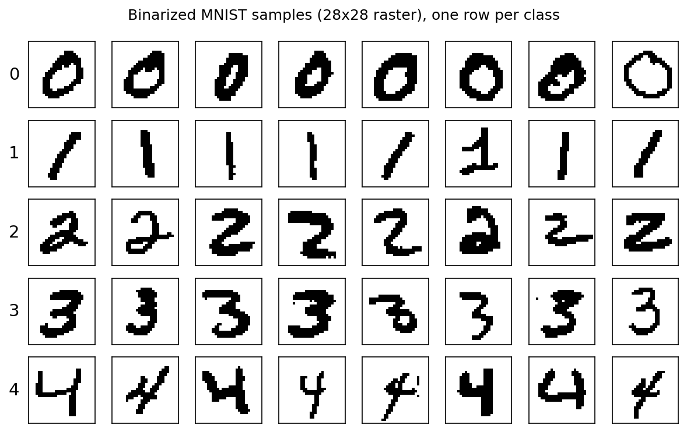
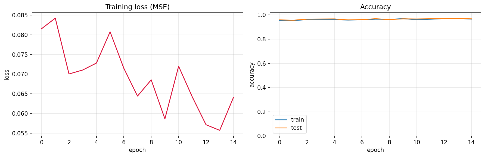
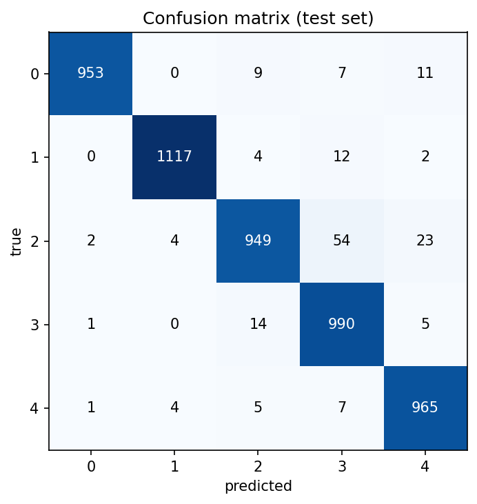
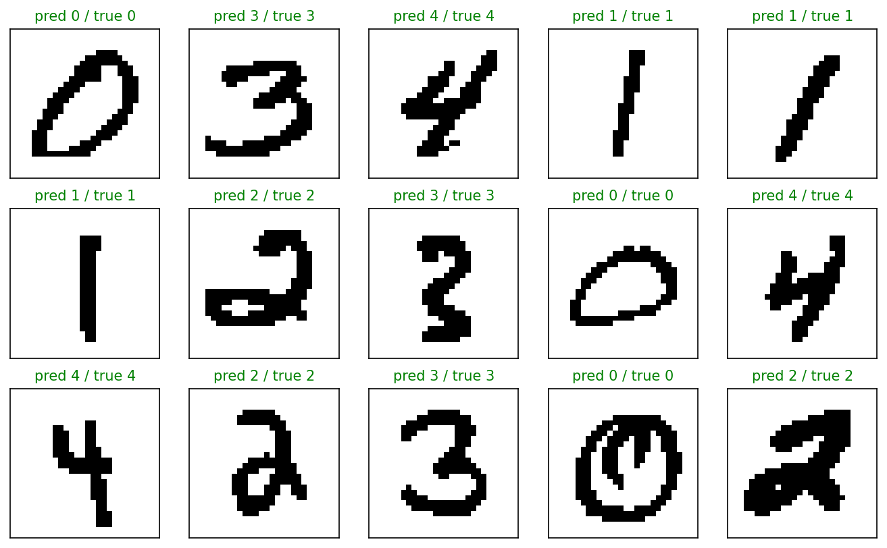
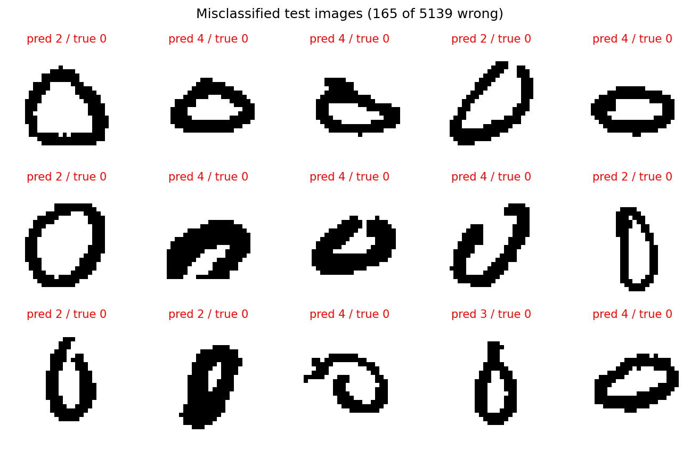

# Identification of 5 binary digit images with a raw NumPy neural network

**Homework 6 — Level I, Variant 5.**

> Develop a Python script that identifies binary images of **5 digits** defined by
> a raster matrix. For identification, synthesize, train, and apply an artificial
> neural network in a "raw" form (matrix-operations implementation, no ML
> frameworks). Justify the choice of the network architecture and training
> algorithm. Prove the workability and efficiency of the synthesized network.

**Note on the data — why MNIST.** The lecture example (`Neural_Networks_numpy_2.py`)
defines each class with a *single* hand-drawn 5×6 glyph and then tests on those same
pictures, which can only demonstrate memorization. I decided to use the **MNIST**
handwritten-digit dataset instead, to have far more data and a real train/test split
— so the result actually *proves generalization* rather than recall. Each image is
binarized to a strict `{0,1}` raster, as the task requires. 

## Data

- MNIST, digits **0–4**, all available samples: **30,596 train / 5,139 test** images.
- Each 28×28 grayscale image is binarized at threshold 50 → strict `{0,1}` raster,
  then flattened to a 784-element vector.
- Loaded via the official keras MNIST `.npz`



## Network architecture and training — justification

The exact lecture baseline, adapted only to the data shape:

```
input 784  ->  hidden 5 (sigmoid)  ->  output 5 (sigmoid)
```

- **784 inputs** — one neuron per pixel of the binary raster; the raw image *is* the
  feature vector (no hand-crafted features, matching the "raw" requirement).
- **Hidden layer of 5 sigmoid units** — same size and activation as the lecture. A
  single hidden layer is already enough to separate 5 digit classes.
- **5 sigmoid outputs**, one per class; the predicted digit is the arg-max.
- **No bias terms**, **MSE loss**, **plain random weight initialization** — as in the
  lecture.
- **Per-sample gradient descent** (one weight update per image), learning rate
  `α = 0.1`, 15 epochs. Because the data is stored class-by-class, the sample order is
  shuffled each epoch so the updates aren't dominated by ordering.

This is the simplest sensible network; we justify it by its measured performance below.

## Results — proof of workability and efficiency

**Training curves.** With per-sample updates one epoch equals ~30,000 weight updates,
so the network is already near-converged (~96%) after the first epoch. Crucially, the
**train and test accuracy track each other** throughout — there is no train/test gap,
which means the network generalizes rather than memorizes.



**Overall test accuracy: 96.8%** (4,974 / 5,139 correct, 165 errors) on the held-out
test set — against a 20% random-chance baseline for 5 classes.

**Confusion matrix and per-class accuracy.**

| digit | test accuracy |
|:-----:|:-------------:|
|   0   |     97.2%     |
|   1   |     98.4%     |
|   2   |     92.0%     |
|   3   |     98.0%     |
|   4   |     98.3%     |



The errors are **concentrated, not random**: digit **2** is the hardest, confused
mostly with **3** (54 cases) and **4** (23 cases) — visually plausible mistakes.

**Sample predictions** (green = correct, red = wrong):



**Misclassified examples.** The 165 errors are dominated by distorted or sloppy
handwriting that genuinely resembles another digit:



## Conclusions

- The raw-NumPy lecture network (`784 → 5 → 5`, sigmoid, MSE, per-sample gradient
  descent, no biases) **identifies the 5 binary digit rasters with ~96.8% test
  accuracy**.
- This proves both **workability** — the hand-coded matrix forward pass and
  back-propagation train the network successfully (loss decreases, accuracy rises) —
  and **efficiency**: high accuracy on *unseen* handwriting with `train ≈ test`, i.e.
  genuine generalization, not memorization.
- The architecture choice is justified by the result: even a 5-unit hidden layer is
  sufficient for this 5-class problem, and the residual errors fall on the genuinely
  ambiguous digit **2 ↔ 3/4** confusions rather than being spread randomly.
- If higher accuracy on digit 2 were required, the next step from this baseline would
  be a larger / ReLU hidden layer with a softmax output and cross-entropy loss.

## Setup

```bat
python -m venv .venv
.venv\Scripts\activate.bat
pip install -r requirements.txt
python digit_identification.py
```

The notebook `digit_identification.ipynb` runs the same pipeline interactively. Every
figure is also saved to `outputs/`.
